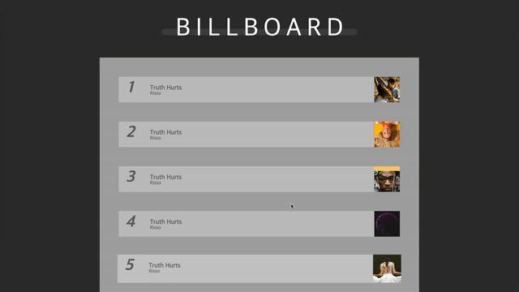
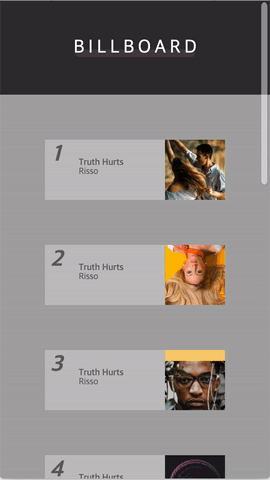

## DevelUP 빌보드 랭킹 홈페이지

**데벨업 라이브 세션** 빌보드 랭킹 홈페이지를 
`React`를 사용해서 구현한 레파지토리 입니다. 

### Episode 2 | DevelUP Live Session

#### [[원본 Git Repository]](https://github.com/develup-official/css-ep2-billie-board)

### 필요한 기초개념
- 선택자 `Seletor`
- 가상요소 `Pseudo Elements`
- 마진겹침 `Margin Collapse`
- 포지션속성 `Position Property`

### Demo

- PC Version

 

- Mobile Version

